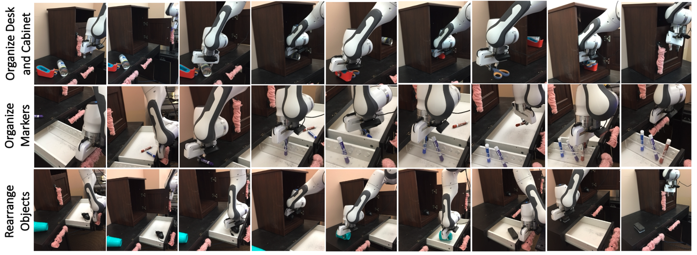

# awesome-long-horizon-manipulation

This repository is mainly about robot long horizon / sequential manipulation. This is an ongoing project now, so keep an eye on it.

Related works are listed as follows:

> Note that some works are just pre-printed articles.

## Methodology

### Constraint graph

1. [Learning Efficient Constraint Graph Sampling for Robotic Sequential Manipulation](http://arxiv.org/abs/2011.04828) ICRA 2021 | [Video](https://youtu.be/mCNdvjTbHNI)

   > Joaquim Ortiz-Haro, Valentin N. Hartmann, Ozgur S. Oguz, Marc Toussaint

   

       
Abstract

   Efficient sampling from constraint manifolds, and thereby generating a diverse set of solutions for feasibility problems, is a fundamental challenge. We consider the case where a problem is factored, that is, the underlying nonlinear program is decomposed into differentiable equality and inequality constraints, each of which depends only on some variables. Such problems are at the core of efficient and robust sequential robot manipulation planning. Naive sequential conditional sampling of individual variables, as well as fully joint sampling of all variables at once (e.g., leveraging optimization methods), can be highly inefficient and non-robust. We propose a novel framework to learn how to break the overall problem into smaller sequential sampling problems. Specifically, we leverage Monte-Carlo Tree Search to learn assignment orders for the variable-subsets, in order to minimize the computation time to generate feasible full samples. This strategy allows us to efficiently compute a set of diverse valid robot configurations for mode-switches within sequential manipulation tasks, which are waypoints for subsequent trajectory optimization or samplingbased motion planning algorithms. We show that the learning method quickly converges to the best sampling strategy for a given problem, and outperforms user-defined orderings or fully joint optimization, while providing a higher sample diversity. Video: https://youtu.be/mCNdvjTbHNI
   

   

   

2. [Multi-robot grasp planning for sequential assembly operations](https://doi.org/10.1007/s10514-018-9748-z) Autonomous Robots 2019 | [Video](https://www.youtube.com/watch?v=vBymMF6mrhI)

   > Mehmet Dogar, Andrew Spielberg, Stuart Baker, Daniela Rus

   

       
Abstract

   This paper addresses the problem of finding robot configurations to grasp assembly parts during a sequence of collaborative assembly operations. We formulate the search for such configurations as a constraint satisfaction problem (CSP). Collision constraints in an operation and transfer constraints between operations determine the sets of feasible robot configurations. We show that solving the connected constraint graph with off-the-shelf CSP algorithms can quickly become infeasible even for a few sequential assembly operations. We present an algorithm which, through the assumption of feasible regrasps, divides the CSP into independent smaller problems that can be solved exponentially faster. The algorithm then uses local search techniques to improve this solution by removing a gradually increasing number of regrasps from the plan. The algorithm enables the user to stop the planner anytime and use the current best plan if the cost of removing regrasps from the plan exceeds the cost of executing those regrasps. We present simulation experiments to compare our algorithm’s performance to a naive algorithm which directly solves the connected constraint graph. We also present a physical robot system which uses the output of our planner to grasp and bring parts together in assembly configurations.
   

   
   
   
   

### Tree search

1. [Long-Horizon Multi-Robot Rearrangement Planning for Construction Assembly](http://arxiv.org/abs/2106.02489) T-RO 2022 | [Video](https://www.youtube.com/watch?v=GqhouvL5dig)

   > Valentin N. Hartmann, Andreas Orthey, Danny Driess, Ozgur S. Oguz, Marc Toussaint

   

       
Abstract

   Robotic assembly planning enables architects to explicitly account for the assembly process during the design phase, and enables efficient building methods that profit from the robots’ different capabilities. Previous work has addressed planning of robot assembly sequences and identifying the feasibility of architectural designs. This paper extends previous work by enabling planning with large, heterogeneous teams of robots. We present a planning system which enables parallelization of complex task and motion planning problems by iteratively solving smaller subproblems. Combining optimization methods to solve for manipulation constraints with a sampling-based bi-directional space-time path planner enables us to plan cooperative multirobot manipulation with unknown arrival-times. Thus, our solver allows for completing subproblems and tasks with differing timescales and synchronizes them effectively. We demonstrate the approach on multiple case-studies to show the robustness over long planning horizons and scalability to many objects and agents of our algorithm. Finally, we also demonstrate the execution of the computed plans on two robot arms to showcase the feasibility in the real world.
   

   

   

2. [Broadly-Exploring, Local-Policy Trees for Long-Horizon Task Planning](https://www.semanticscholar.org/reader/72c034e53213cc2f4913d73dd838b64d7b641585) CoRL 2021

   > Brian Ichter, Pierre Sermanet, Corey Lynch

   

       
Abstract

   Long-horizon planning in realistic environments requires the ability to reason over sequential tasks in high-dimensional state spaces with complex dynamics. Classical motion planning algorithms, such as rapidly-exploring random trees, are capable of efficiently exploring large state spaces and computing longhorizon, sequential plans. However, these algorithms are generally challenged with complex, stochastic, and high-dimensional state spaces as well as in the presence of narrow passages, which naturally emerge in tasks that interact with the environment. Machine learning offers a promising solution for its ability to learn general policies that can handle complex interactions and high-dimensional observations. However, these policies are generally limited in horizon length. Our approach, Broadly-Exploring, Local-policy Trees (BELT), merges these two approaches to leverage the strengths of both through a task-conditioned, modelbased tree search. BELT uses an RRT-inspired tree search to efficiently explore the state space. Locally, the exploration is guided by a task-conditioned, learned policy capable of performing general short-horizon tasks. This task space can be quite general and abstract; its only requirements are to be sampleable and to wellcover the space of useful tasks. This search is aided by a task-conditioned model that temporally extends dynamics propagation to allow long-horizon search and sequential reasoning over tasks. BELT is demonstrated experimentally to be able to plan long-horizon, sequential trajectories with a goal conditioned policy and generate plans that are robust.
   

   

   

   

3. [Long-Horizon Visual Planning with Goal-Conditioned Hierarchical Predictors](https://proceedings.neurips.cc/paper/2020/hash/c8d3a760ebab631565f8509d84b3b3f1-Abstract.html) NeurIPS 2020 | [Website](https://orybkin.github.io/video-gcp/) [Code](https://github.com/orybkin/video-gcp)

   > Karl Pertsch, Oleh Rybkin, Frederik Ebert, Chelsea Finn, Dinesh Jayaraman, Sergey Levine

   

       
Abstract

   The ability to predict and plan into the future is fundamental for agents acting in the world. To reach a faraway goal, we predict trajectories at multiple timescales, first devising a coarse plan towards the goal and then gradually filling in details. In contrast, current learning approaches for visual prediction and planning fail on longhorizon tasks as they generate predictions (1) without considering goal information, and (2) at the finest temporal resolution, one step at a time. In this work we propose a framework for visual prediction and planning that is able to overcome both of these limitations. First, we formulate the problem of predicting towards a goal and propose the corresponding class of latent space goal-conditioned predictors (GCPs). GCPs significantly improve planning efficiency by constraining the search space to only those trajectories that reach the goal. Further, we show how GCPs can be naturally formulated as hierarchical models that, given two observations, predict an observation between them, and by recursively subdividing each part of the trajectory generate complete sequences. This divide-and-conquer strategy is effective at long-term prediction, and enables us to design an effective hierarchical planning algorithm that optimizes trajectories in a coarse-to-fine manner. We show that by using both goal-conditioning and hierarchical prediction, GCPs enable us to solve visual planning tasks with much longer horizon than previously possible.
   

   
   
   
   
   
   

### Reinforcement learning

1. [Skill-based Model-based Reinforcement Learning]() CoRL2022 | [Web](https://clvrai.com/skimo/) [Code](https://github.com/clvrai/skimo)

   > Lucy Xiaoyang Shi, Joseph J. Lim, Youngwoon Lee

   

       
Abstract

   Model-based reinforcement learning (RL) is a sample-efficient way of learning complex behaviors by leveraging a learned single-step dynamics model to plan actions in imagination. However, planning every action for long-horizon tasks is not practical, akin to a human planning out every muscle movement. Instead, humans efficiently plan with high-level skills to solve complex tasks. From this intuition, we propose a Skill-based Model-based RL framework (SkiMo) that enables planning in the skill space using a skill dynamics model, which directly predicts the skill outcomes, rather than predicting all small details in the intermediate states, step by step. For accurate and efficient long-term planning, we jointly learn the skill dynamics model and a skill repertoire from prior experience. We then harness the learned skill dynamics model to accurately simulate and plan over long horizons in the skill space, which enables efficient downstream learning of long-horizon, sparse reward tasks. Experimental results in navigation and manipulation domains show that SkiMo extends the temporal horizon of model-based approaches and improves the sample efficiency for both model-based RL and skill-based RL. Code and videos are available at https://clvrai.com/skimo.
   

   

   

   

1. [Example-Driven Model-Based Reinforcement Learning for Solving Long-Horizon Visuomotor Tasks](http://arxiv.org/abs/2109.10312) CoRL 2021 | [Code](https://github.com/suraj-nair-1/lorel)

   > Bohan Wu, Suraj Nair, Li Fei-Fei†, Chelsea Finn

   

       
Abstract

   In this paper, we study the problem of learning a repertoire of lowlevel skills from raw images that can be sequenced to complete long-horizon visuomotor tasks. Reinforcement learning (RL) is a promising approach for acquiring short-horizon skills autonomously. However, the focus of RL algorithms has largely been on the success of those individual skills, more so than learning and grounding a large repertoire of skills that can be sequenced to complete extended multi-stage tasks. The latter demands robustness and persistence, as errors in skills can compound over time, and may require the robot to have a number of primitive skills in its repertoire, rather than just one. To this end, we introduce EMBER, a model-based RL method for learning primitive skills that are suitable for completing long-horizon visuomotor tasks. EMBER learns and plans using a learned model, critic, and success classifier, where the success classifier serves both as a reward function for RL and as a grounding mechanism to continuously detect if the robot should retry a skill when unsuccessful or under perturbations. Further, the learned model is task-agnostic and trained using data from all skills, enabling the robot to efficiently learn a number of distinct primitives. These visuomotor primitive skills and their associated pre- and post-conditions can then be directly combined with off-the-shelf symbolic planners to complete long-horizon tasks. On a Franka Emika robot arm, we find that EMBER enables the robot to complete three long-horizon visuomotor tasks at 85% success rate, such as organizing a desk, a cabinet, and drawers, which require sequencing up to 12 skills, involve 14 unique learned primitives, and demand generalization to novel objects.
   

   

   

   

1. [IKEA Furniture Assembly Environment for Long-Horizon Complex Manipulation Tasks](https://arxiv.org/abs/1911.07246) ICRA 2021 | [Code](https://github.com/clvrai/furniture)

   > Youngwoon Lee, Edward S. Hu, and Joseph J. Lim

   

       
Abstract

   The IKEA Furniture Assembly Environment is one of the first benchmarks for testing and accelerating the automation of long-horizon and hierarchical manipulation tasks. The environment is designed to advance reinforcement learning and imitation learning from simple toy tasks to complex tasks requiring both long-term planning and sophisticated low-level control. Our environment features 60 furniture models, 6 robots, photorealistic rendering, and domain randomization. We evaluate reinforcement learning and imitation learning methods on the proposed environment. Our experiments show furniture assembly is a challenging task due to its long horizon and sophisticated manipulation requirements, which provides ample opportunities for future research. The environment is publicly available at https://clvrai.com/furniture.
   

   

1. [Maximum Entropy Gain Exploration for Long Horizon Multi-goal Reinforcement Learning](https://proceedings.mlr.press/v119/pitis20a.html) ICML 2020

   > Silviu Pitis, Harris Chan, Stephen Zhao, Bradly Stadie, Jimmy Ba

   

       
Abstract

   What goals should a multi-goal reinforcement learning agent pursue during training in longhorizon tasks? When the desired (test time) goal distribution is too distant to offer a useful learning signal, we argue that the agent should not pursue unobtainable goals. Instead, it should set its own intrinsic goals that maximize the entropy of the historical achieved goal distribution. We propose to optimize this objective by having the agent pursue past achieved goals in sparsely explored areas of the goal space, which focuses exploration on the frontier of the achievable goal set. We show that our strategy achieves an order of magnitude better sample efficiency than the prior state of the art on long-horizon multi-goal tasks including maze navigation and block stacking.
   

   

1. [Is Long Horizon Reinforcement Learning More Difficult Than Short Horizon Reinforcement Learning?](http://arxiv.org/abs/2005.00527) NeurIPS 2020

   > Ruosong Wang, Simon S. Du, Lin F. Yang, Sham M. Kakade

   

       
Abstract

   Learning to plan for long horizons is a central challenge in episodic reinforcement learning problems. A fundamental question is to understand how the difficulty of the problem scales as the horizon increases. Here the natural measure of sample complexity is a normalized one: we are interested in the number of episodes it takes to provably discover a policy whose value is ε near to that of the optimal value, where the value is measured by the normalized cumulative reward in each episode. In a COLT 2018 open problem, Jiang and Agarwal conjectured that, for tabular, episodic reinforcement learning problems, there exists a sample complexity lower bound which exhibits a polynomial dependence on the horizon — a conjecture which is consistent with all known sample complexity upper bounds. This work refutes this conjecture, proving that tabular, episodic reinforcement learning is possible with a sample complexity that scales only logarithmically with the planning horizon. In other words, when the values are appropriately normalized (to lie in the unit interval), this results shows that long horizon RL is no more difficult than short horizon RL, at least in a minimax sense. Our analysis introduces two ideas: (i) the construction of an ε-net for optimal policies whose log-covering number scales only logarithmically with the planning horizon, and (ii) the Online Trajectory Synthesis algorithm, which adaptively evaluates all policies in a given policy class using sample complexity that scales with the log-covering number of the given policy class. Both may be of independent interest.
   

1. [Multi-Channel Interactive Reinforcement Learning for Sequential Tasks](https://www.frontiersin.org/articles/10.3389/frobt.2020.00097/full) Frontiers 2020

   > Dorothea Koert, Maximilian Kircher, Vildan Salikutluk, Carlo D’Eramo, and Jan Peters

   

       
Abstract

   The ability to learn new tasks by sequencing already known skills is an important requirement for future robots. Reinforcement learning is a powerful tool for this as it allows for a robot to learn and improve on how to combine skills for sequential tasks. However, in real robotic applications, the cost of sample collection and exploration prevent the application of reinforcement learning for a variety of tasks. To overcome these limitations, human input during reinforcement can be beneficial to speed up learning, guide the exploration and prevent the choice of disastrous actions. Nevertheless, there is a lack of experimental evaluations of multi-channel interactive reinforcement learning systems solving robotic tasks with input from inexperienced human users, in particular for cases where human input might be partially wrong. Therefore, in this paper, we present an approach that incorporates multiple human input channels for interactive reinforcement learning in a unified framework and evaluate it on two robotic tasks with 20 inexperienced human subjects. To enable the robot to also handle potentially incorrect human input we incorporate a novel concept for self-confidence, which allows the robot to question human input after an initial learning phase. The second robotic task is specifically designed to investigate if this self-confidence can enable the robot to achieve learning progress even if the human input is partially incorrect. Further, we evaluate how humans react to suggestions of the robot, once the robot notices human input might be wrong. Our experimental evaluations show that our approach can successfully incorporate human input to accelerate the learning process in both robotic tasks even if it is partially wrong. However, not all humans were willing to accept the robot’s suggestions or its questioning of their input, particularly if they do not understand the learning process and the reasons behind the robot’s suggestions. We believe that the findings from this experimental evaluation can be beneficial for the future design of algorithms and interfaces of interactive reinforcement learning systems used by inexperienced users.
   

   
   

### Imitation learning

1. [Learning Sensorimotor Primitives of Sequential Manipulation Tasks from Visual Demonstrations](https://ieeexplore.ieee.org/document/9811703/) ICRA 2022 | [Website](https://tinyurl.com/2zrp2rzm)

   > Junchi Liang, Bowen Wen, Kostas Bekris and Abdeslam Boularias

   

       
Abstract

   This work aims to learn how to perform complex robot manipulation tasks that are composed of several, consecutively executed low-level sub-tasks, given as input a few visual demonstrations of the tasks performed by a person. The sub-tasks consist of moving the robot's end-effector until it reaches a sub-goal region in the task space, performing an action, and triggering the next sub-task when a pre-condition is met. Most prior work in this domain has been concerned with learning only low-level tasks, such as hitting a ball or reaching an object and grasping it. This paper describes a new neural network-based framework for learning simultaneously low-level policies as well as high-level policies, such as deciding which object to pick next or where to place it relative to other objects in the scene. A key feature of the proposed approach is that the policies are learned directly from raw videos of task demonstrations, without any manual annotation or postprocessing of the data. Empirical results on object manipulation tasks with a robotic arm show that the proposed network can efciently learn from real visual demonstrations to perform the tasks, and outperforms popular imitation learning algorithms.
   

   

   

2. [Sequential robot imitation learning from observations](https://journals.sagepub.com/doi/10.1177/02783649211032721) IJRR 2021

   > Ajay Kumar Tanwani, Andy Yan, Jonathan Lee, Sylvain Calinon and Ken Goldberg

   

       
Abstract

   This paper presents a framework to learn the sequential structure in the demonstrations for robot imitation learning. We first present a family of task-parameterized hidden semi-Markov models that extracts invariant segments (also called subgoals or options) from demonstrated trajectories, and optimally follows the sampled sequence of states from the model with a linear quadratic tracking controller. We then extend the concept to learning invariant segments from visual observations that are sequenced together for robot imitation. We present Motion2Vec that learns a deep embedding space by minimizing a metric learning loss in a Siamese network: images from the same action segment are pulled together while being pushed away from randomly sampled images of other segments, and a time contrastive loss is used to preserve the temporal ordering of the images. The trained embeddings are segmented with a recurrent neural network, and subsequently used for decoding the end-effector pose of the robot. We first show its application to a pick-and-place task with the Baxter robot while avoiding a moving obstacle from four kinesthetic demonstrations only, followed by suturing task imitation from publicly available suturing videos of the JIGSAWS dataset with state-of-the-art 85.5% segmentation accuracy and 0.94 cm error in position per observation on the test set.
   

   

3. [Modeling Long-horizon Tasks as Sequential Interaction Landscapes](http://arxiv.org/abs/2006.04843) CoRL 2020

   > Soren Pirk, Karol Hausman, Alexander Toshev, Mohi Khansari

   

       
Abstract

   Task planning over long time horizons is a challenging and open problem in robotics and its complexity grows exponentially with an increasing number of subtasks. In this paper we present a deep neural network that learns dependencies and transitions across subtasks solely from a set of demonstration videos. We represent each subtasks as action symbols, and show that these symbols can be learned and predicted directly from image observations. Learning symbol sequences provides our network with additional information about the most frequent transitions and relevant dependencies between subtasks and thereby structures tasks over long-time horizons. Learning from images, on the other hand, allows the network to continuously monitor the task progress and thus to interactively adapt to changes in the environment. We evaluate our framework on two long horizon tasks: (1) block stacking of puzzle pieces being executed by humans, and (2) a robot manipulation task involving pick and place of objects and sliding a cabinet door with a 7-DoF robot arm. We show that complex plans can be carried out when executing the robotic task and the robot can interactively adapt to changes in the environment and recover from failure cases. A video illustrating live-action captures of our system is provided as supplementary material.
   

   

   

4. [Learning and Sequencing of Object-Centric Manipulation Skills for Industrial Tasks](https://arxiv.org/abs/2008.10471) IROS 2020

   > Leonel Rozo, Meng Guo, Andras G. Kupcsik, Marco Todescato, Philipp Schillinger, Markus Giftthaler, Matthias Ochs, Markus Spies, Nicolai Waniek, Patrick Kesper, Mathias Burger

   

       
Abstract

   Enabling robots to quickly learn manipulation skills is an important, yet challenging problem. Such manipulation skills should be flexible, e.g., be able adapt to the current workspace configuration. Furthermore, to accomplish complex manipulation tasks, robots should be able to sequence several skills and adapt them to changing situations. In this work, we propose a rapid robot skill-sequencing algorithm, where the skills are encoded by object-centric hidden semi-Markov models. The learned skill models can encode multimodal (temporal and spatial) trajectory distributions. This approach significantly reduces manual modeling efforts, while ensuring a high degree of flexibility and re-usability of learned skills. Given a task goal and a set of generic skills, our framework computes smooth transitions between skill instances. To compute the corresponding optimal end-effector trajectory in task space we rely on Riemannian optimal controller. We demonstrate this approach on a 7 DoF robot arm for industrial assembly tasks.
   

   

### Imitation and Reinforcement learning

1. [Adversarial Skill Chaining for Long-Horizon Robot Manipulation via Terminal State Regularization](https://openreview.net/forum?id=K5-J-Espnaq) CoRL 2021 | [Web](https://clvrai.github.io/skill-chaining/) [Code](https://github.com/clvrai/skill-chaining)

   > Youngwoon Lee, Joseph J. Lim, Anima Anandkumar, Yuke Zhu

   

       
Abstract

   Skill chaining is a promising approach for synthesizing complex behaviors by sequentially combining previously learned skills. Yet, a naive composition of skills fails when a policy encounters a starting state never seen during its training. For successful skill chaining, prior approaches attempt to widen the policy’s starting state distribution. However, these approaches require larger state distributions to be covered as more policies are sequenced, and thus are limited to short skill sequences. In this paper, we propose to chain multiple policies without excessively large initial state distributions by regularizing the terminal state distributions in an adversarial learning framework. We evaluate our approach on two complex long-horizon manipulation tasks of furniture assembly. Our results have shown that our method establishes the first model-free reinforcement learning algorithm to solve these tasks; whereas prior skill chaining approaches fail. The code and videos are available at https://clvrai.com/skill-chaining.
   

   

2. [Relay Policy Learning: Solving Long-Horizon Tasks via Imitation and Reinforcement Learning](http://arxiv.org/abs/1910.11956) CoRL 2019 | [Web](https://relay-policy-learning.github.io/) [Code](https://github.com/google-research/relay-policy-learning)

   > Abhishek Gupta, Vikash Kumar, Corey Lynch, Sergey Levine,  Karol Hausman

   

       
Abstract

   We present relay policy learning, a method for imitation and reinforcement learning that can solve multi-stage, long-horizon robotic tasks. This general and universally-applicable, two-phase approach consists of an imitation learning stage that produces goal-conditioned hierarchical policies, and a reinforcement learning phase that finetunes these policies for task performance. Our method, while not necessarily perfect at imitation learning, is very amenable to further improvement via environment interaction, allowing it to scale to challenging longhorizon tasks. We simplify the long-horizon policy learning problem by using a novel data-relabeling algorithm for learning goal-conditioned hierarchical policies, where the low-level only acts for a fixed number of steps, regardless of the goal achieved. While we rely on demonstration data to bootstrap policy learning, we do not assume access to demonstrations of every specific tasks that is being solved, and instead leverage unstructured and unsegmented demonstrations of semantically meaningful behaviors that are not only less burdensome to provide, but also can greatly facilitate further improvement using reinforcement learning. We demonstrate the effectiveness of our method on a number of multi-stage, long-horizon manipulation tasks in a challenging kitchen simulation environment. Videos are available at https://relay-policy-learning.github.io/
   

   

   

   

3. [SWIRL: A sequential windowed inverse reinforcement learning algorithm for robot tasks with delayed rewards](https://doi.org/10.1177/0278364918784350) IJRR 2018

   > Sanjay Krishnan, Animesh Garg,RichardLiaw, Brijen Thananjeyan, Lauren Miller, Florian T Pokorny and Ken Goldberg

   

       
Abstract

   We present sequential windowed inverse reinforcement learning (SWIRL), a policy search algorithm that is a hybrid of exploration and demonstration paradigms for robot learning. We apply unsupervised learning to a small number of initial expert demonstrations to structure future autonomous exploration. SWIRL approximates a long time horizon task as a sequence of local reward functions and subtask transition conditions. Over this approximation, SWIRL applies Q-learning to compute a policy that maximizes rewards. Experiments suggest that SWIRL requires significantly fewer rollouts than pure reinforcement learning and fewer expert demonstrations than behavioral cloning to learn a policy. We evaluate SWIRL in two simulated control tasks, parallel parking and a two-link pendulum. On the parallel parking task, SWIRL achieves the maximum reward on the task with 85% fewer rollouts than Q-learning, and one-eight of demonstrations needed by behavioral cloning. We also consider physical experiments on surgical tensioning and cutting deformable sheets using a da Vinci surgical robot. On the deformable tensioning task, SWIRL achieves a 36% relative improvement in reward compared with a baseline of behavioral cloning with segmentation.
   

   

4. [HIRL: Hierarchical Inverse Reinforcement Learning for Long-Horizon Tasks with Delayed Rewards](http://arxiv.org/abs/1604.06508) 2016

   > Sanjay Krishnan, Animesh Garg, Richard Liaw, Lauren Miller, Florian T. Pokorny, Ken Goldberg

   

       
Abstract

   Reinforcement Learning (RL) struggles in problems with delayed rewards, and one approach is to segment the task into sub-tasks with incremental rewards. We propose a framework called Hierarchical Inverse Reinforcement Learning (HIRL), which is a model for learning sub-task structure from demonstrations. HIRL decomposes the task into sub-tasks based on transitions that are consistent across demonstrations. These transitions are defined as changes in local linearity w.r.t to a kernel function [21]. Then, HIRL uses the inferred structure to learn reward functions local to the sub-tasks but also handle any global dependencies such as sequentiality. We have evaluated HIRL on several standard RL benchmarks: Parallel Parking with noisy dynamics, Two-Link Pendulum, 2D Noisy Motion Planning, and a Pinball environment. In the parallel parking task, we find that rewards constructed with HIRL converge to a policy with an 80% success rate in 32% fewer time-steps than those constructed with Maximum Entropy Inverse RL (MaxEnt IRL), and with partial state observation, the policies learned with IRL fail to achieve this accuracy while HIRL still converges. We further find that that the rewards learned with HIRL are robust to environment noise where they can tolerate 1 stdev. of random perturbation in the poses in the environment obstacles while maintaining roughly the same convergence rate. We find that HIRL rewards can converge up-to 6× faster than rewards constructed with IRL.
   

5. [Learning Sequential Tasks Interactively from Demonstrations and Own Experience](https://ieeexplore.ieee.org/stamp/stamp.jsp?arnumber=6696816) IROS 2013

   > Kathrin Gräve and Sven Behnke

   

       
Abstract

   Deploying robots to our day-to-day life requires them to have the ability to learn from their environment in order to acquire new task knowledge and to flexibly adapt existing skills to various situations. For typical real-world tasks, it is not sufficient to endow robots with a set of primitive actions. Rather, they need to learn how to sequence these in order to achieve a desired effect on their environment. In this paper, we propose an intuitive learning method for a robot to acquire sequences of motions by combining learning from human demonstrations and reinforcement learning. In every situation, our approach treats both ways of learning as alternative control flows to optimally exploit their strengths without inheriting their shortcomings. Using a Gaussian Process approximation of the state-action sequence value function, our approach generalizes values observed from demonstrated and autonomously generated action sequences to unknown inputs. This approximation is based on a kernel we designed to account for different representations of tasks and action sequences as well as inputs of variable length. From the expected deviation of value estimates, we devise a greedy exploration policy following a Bayesian optimization criterion that quickly converges learning to promising action sequences while protecting the robot from sequences with unpredictable outcome. We demonstrate the ability of our approach to efficiently learn appropriate action sequences in various situations on a manipulation task involving stacked boxes.
   

   
